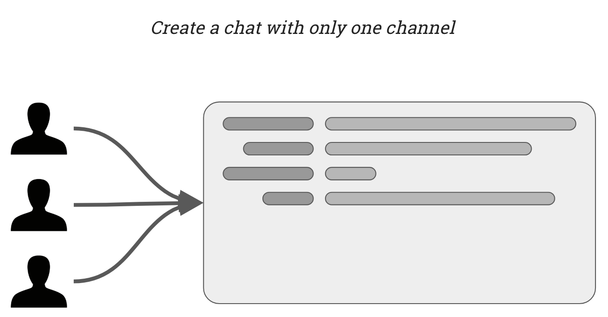
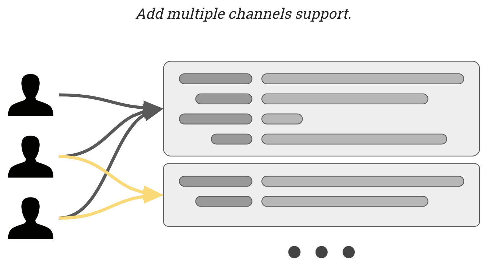
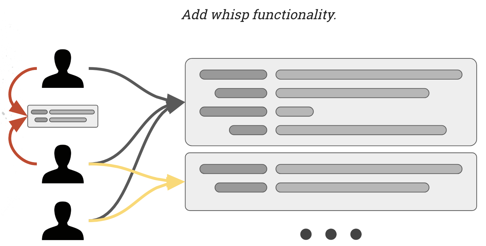
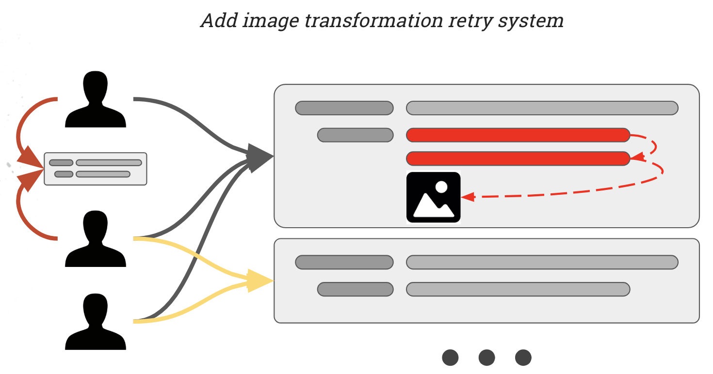

# Workshop chat server with RabbitMQ

## Installation

You need to
 
```
docker-compose up -d
```

> The docker use local port `80` `5672` `15672`

Open your browser (Chrome) and go to [http://localhost/](http://localhost/)
You can verify your config at [http://localhost/configtest.php](http://localhost/configtest.php).
All is ok if the last text block appear over the time

```
Begin stream text during 3sec with 10 character string...
 ├ 1 ..........
 ├ 2 ..........
 ├ 3 ..........
 └ End test.
 ```

## Exercises

One exercise per branch.
For each exercise you must do :
- initialise the exchange in the `bootstrap.php` file with the correct exchange type.
- initialise the user queue in the `consumer.php` file with the right options and binding.

The solution of each exercise are in solution branches:
- step-1-solution
- step-2-solution
- step-3-solution
- step-4-solution

## Step 1

```
git checkout step-1
``` 

You must initialise the exchange in the `bootstrap.php` file with the correct exchange type.
You must initialise the user queue in the `consumer.php` file with the right options and binding.

Step 1 goal is to have a chat with **only one** channel with all message public. 
One write message and all other user get it.



## Step 2

```
git checkout step-2
``` 

You must initialise the exchange in the `bootstrap.php` file with the correct exchange type.
You must initialise the user queue in the `consumer.php` file with the right options and binding.

Step 2 goal is to have a chat with **multiple** channel. 
Message are specific to a channel.
Only user in the channel can received the message.
User join channel with the command `/join [channel_name]`.
User leave channel with the command `/leave [channel_name]`.



## Step 3

```
git checkout step-3
``` 

Step 3 goal is to have a chat with **multiple** channel. You must add private whisp message.
Channel message are received by user that already joined the channel.
Private message are received by the sender and for the targeted user.
User join channel with the command `/join [channel_name]`.
User leave channel with the command `/leave [channel_name]`.
User can send private me with the command `/w [username] [message]`.



## Step 4

```
git checkout step-4
``` 

Step 4 goal is to match when image link is post and show image directly in the chat.
You need to retry 3 times if the image url respond with error 500

